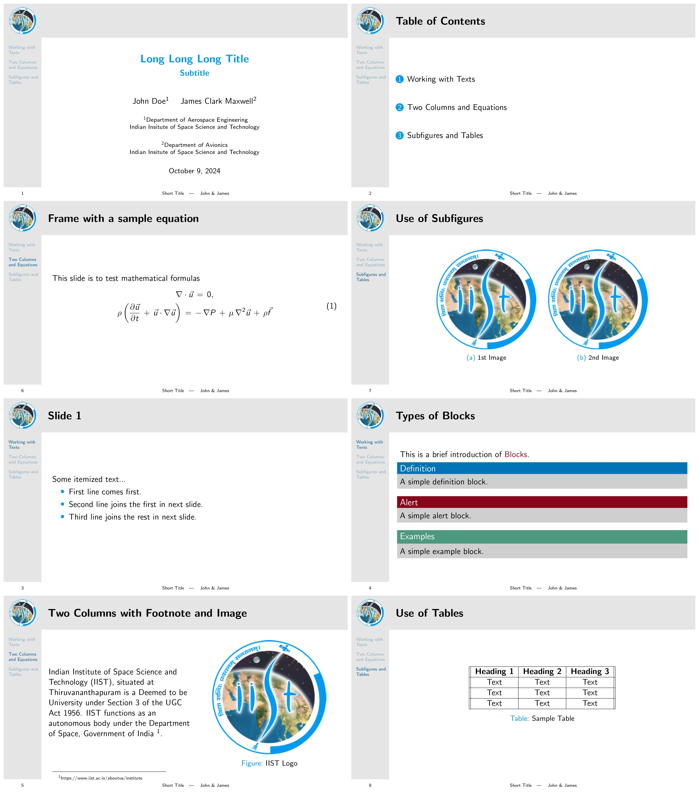

# Beamer Template for IIST Students

## Overview

This repository contains a Beamer template designed specifically for students of the Indian Institute of Space Science and Technology (IIST). It provides a structured and visually appealing way to create presentations that meet academic and professional standards.

## Features

- **Customizable Slide Layouts**: Easily modify the look and feel of your presentations to suit your style.
- **Sidebar Navigation**: Utilize sidebars for easy navigation through sections and subsections.
- **Institutional Branding**: Incorporate the IIST logo and colors for official presentations.
- **Dynamic Footer**: Includes page numbers, presentation title, and author details.

## Getting Started

### Prerequisites

- LaTeX Distribution: Ensure you have a LaTeX distribution installed, such as [TeX Live](https://www.tug.org/texlive/) or [MiKTeX](https://miktex.org/).
- Beamer Package: The Beamer package should be included in your LaTeX distribution (it usually is by default).

### Usage

1. Clone the repository:

   ```bash
   git clone https://github.com/airwarriorg91/iist-beamer-template.git
   cd iist-beamer-template

2. Edit the `iist_beamer_template.tex`.
3. Compile with `pdflatex` twice to obtain best results.

## Screenshots



